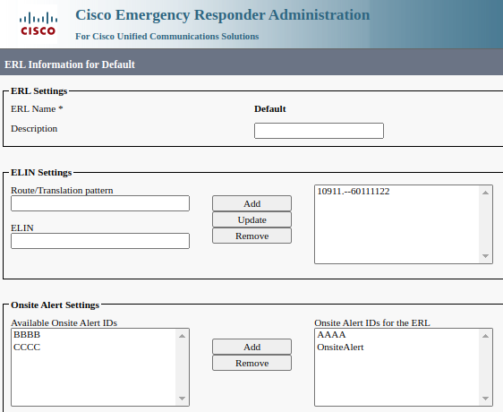

# cer-alert-sort

## Overview

Simple Chrome extension that manipulates the Cisco Emergency Responder **ERL Information** admin web page, sorting the **Available Onsite Alert IDs** and **Onsite Alert IDs for the ERL** select boxes.

This can make individual alerts easier to find for sites with a large number of available alerts, as the select boxes are unsorted by default.

## Getting Started

This project's folder can be loaded as an "unpacked extension" in developer mode, see [Load an unpacked extension](https://developer.chrome.com/docs/extensions/get-started/tutorial/hello-world#load-unpacked)